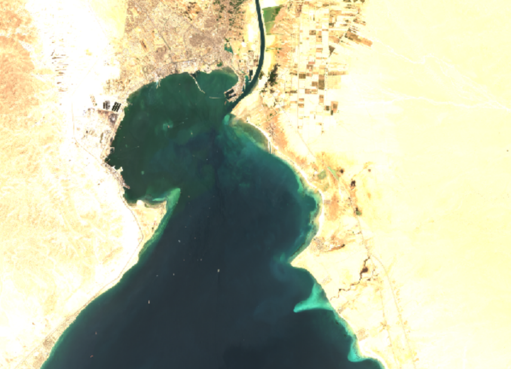
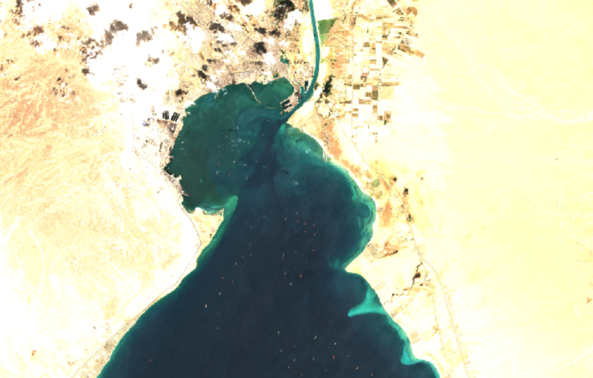
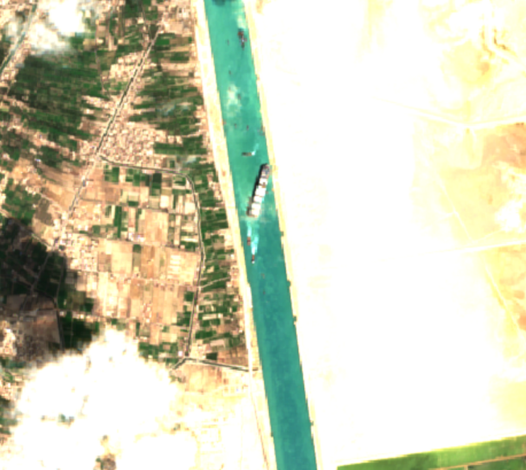

# Maritime Traffic Monitoring — Agentic VLM Satellite PoC

A proof-of-concept demonstrating how agentic vision-language models can run
onboard a satellite to monitor maritime traffic from Sentinel-2 imagery.

The system fetches recent satellite images, analyses them for ship positions
and traffic patterns, detects anomalies, and — when something unusual is
found — autonomously launches an investigation agent that explores surrounding areas
to explain the anomaly.

## Use Case Example: The Ever Given Incident
To demonstrate the application on a real-world scenario, we used the Ever Given incident — a 6-day blockage of the Suez Canal in March 2021, when a 400-meter container ship ran aground and halted global trade. The event is well-suited for testing real-time satellite intelligence, as both the accumulation of vessels in the bay and the grounded ship itself are visible in publicly available Sentinel-2 imagery.

Two pre-run analyses are included in the `examples/` folder, powered by different models (Gemini 3 Flash and Gemma 4).

To explore the results, launch the GUI and upload either of these .zip archive from the sidebar. This loads the full analysis session, where you can inspect the fetched imagery, the agent's step-by-step reasoning, and the final findings.

<p align="center">
  
  
  
</p>


## Prerequisites

- **Python 3.10+**
- **Ollama Cloud API key** — generate one at https://ollama.com/settings/keys

## Setup

```bash
# Clone / navigate to the project directory
cd agentic-vlm-maritime-monitoring

# Create a virtual environment (recommended)
python -m venv .venv
source .venv/bin/activate

# Install dependencies
pip install -r requirements.txt

# Set your Ollama Cloud API key
export OLLAMA_API_KEY="your-key-here"
```

## Usage

### GUI (Streamlit)

The recommended way to use the application — a full dashboard showing fetched
imagery, agent reasoning, investigation steps, evidence, and correlation:

```bash
streamlit run gui.py
```

You can enter your API key directly in the sidebar, or pre-set it via the
environment variable.  The sidebar also lets you switch the host to a local
Ollama instance if needed.

### CLI

```bash
# Set your API key first
export OLLAMA_API_KEY="your-key-here"

# Basic: analyse maritime traffic near the Strait of Gibraltar
python main.py --lat 36.0 --lon -5.5 --timestamp 2025-03-15

# With debug logging
python main.py --lat 36.0 --lon -5.5 --timestamp 2025-03-15 -v

# Save the report to a file
python main.py --lat 51.9 --lon 4.5 --output report.json

# Defaults to today's date if --timestamp is omitted
python main.py --lat 36.0 --lon -5.5

```

### CLI Arguments

| Flag          | Required | Description                                  |
|---------------|----------|----------------------------------------------|
| `--lat`       | yes      | Latitude of the target location              |
| `--lon`       | yes      | Longitude of the target location             |
| `--timestamp` | no       | ISO date/datetime (default: 29/03/2021)      |
| `--output`    | no       | Path to save the JSON report                 |
| `-v`          | no       | Enable verbose debug logging                 |

## Configuration

All tuneable parameters live in `config.py` and can be overridden via
environment variables:

| Variable         | Default                      | Description                        |
|------------------|------------------------------|------------------------------------|
| `OLLAMA_API_KEY` | *(empty)*                    | Ollama Cloud API key (required)    |
| `OLLAMA_HOST`    | `https://ollama.com`         | Ollama endpoint (cloud or local)   |
| `VLM_MODEL`      | `qwen3.5`                    | Model name for Ollama              |
| `VLM_OUTPUT_DIR` | `./output`                   | Directory for final reports        |
| `VLM_TEMP_DIR`   | `./tmp_images`               | Directory for downloaded imagery   |

In-code constants in `config.py`:

| Constant                      | Value | Description                              |
|-------------------------------|-------|------------------------------------------|
| `SEARCH_RADIUS_KM`            | 10    | Radius around target for image search    |
| `MAX_IMAGES`                  | 4     | Maximum Sentinel-2 images to fetch       |
| `MAX_CLOUD_COVER`             | 30    | Maximum cloud cover percentage           |
| `INVESTIGATOR_MAX_ITERATIONS` | 10    | Max tool-calling loop iterations         |


## Architecture

```
Input (lat, lon, timestamp)
        │
        ▼
┌───────────────┐     Element84 STAC API
│  STAC Fetcher │────────────────────────► sentinel-2-l2a
└───────┬───────┘     (pystac-client)      
        │
        ▼
┌─────────────────┐
│ Image Processor │   Windowed COG read → crop → PNG
└───────┬─────────┘
        │
        ▼
┌─────────────────┐
│  Monitor Agent  │   VLM — per-image + temporal analysis
└───────┬─────────┘
        │
   anomaly? ──no──► Report
        │
       yes
        │
        ▼
┌────────────────────┐
│ Investigator Agent │   VLM tool-calling loop
│                    │   Tools: explore_direction, skip_direction,
│                    │          analyze_image, submit_finding
└───────┬────────────┘
        │
        ▼
      Report
```

## How It Works

### 1. Image Acquisition

The STAC fetcher queries the Element84 Earth Search API for recent
Sentinel-2 L2A scenes covering a specified radius around the target.  
It downloads only the `visual` (True Color Image) asset — a pre-composed
RGB Cloud-Optimized GeoTIFF at 10 m/pixel — using windowed reads to avoid
fetching the entire ~110 km tile.

### 2. Monitor Agent

The monitor sends all images to the VLM as a temporal sequence and asks
it to analyze maritime activity, compare across dates for traffic pattern changes
and flag anomalies (unusual clustering, sudden changes, vessels in unexpected
locations, etc.)

The model returns structured analysis ending with an anomaly verdict.

### 3. Investigator Agent

If an anomaly is detected, the investigator agent is spawned with the anomaly
context and access to these tools:

- **explore_direction**: fetch and analyse imagery adjacent to the anomaly (by default several recent Sentinel-2 dates of the same area for before/after comparison; optional `max_temporal_images=1` for a single pass)
  along cardinal bearings **N, E, S, W**
- **skip_direction**: record that a direction was not explored, with reasoning
- **analyze_image**: ask the VLM a focused question about a specific image
- **submit_finding**: record a conclusion with evidence and confidence level

The agent runs a tool-calling loop (up to 10 iterations), autonomously deciding
which tools to invoke and in what order.  After submitting findings, it provides
a final correlation summary linking its evidence to the original anomaly.

### 4. Report

The output is a structured JSON report containing the monitor assessment,
any investigation findings, and the correlation analysis.

The full analysis can also be downloaded as a .zip file and can be later uploaded
to restore the dashboard and visually inspect the results.

## Limitations

- **10 m resolution**: vessels smaller than ~30 m may not be detectable
- **Cloud cover**: maritime areas can have persistent cloud; some images may
  be partially occluded despite the filter
- **VLM accuracy**: Ollama provides general-purpose models, not fine-tuned
  for maritime detection — appropriate for a PoC but not production use
- **Revisit time**: Sentinel-2 revisits every 2-5 days; the fetched images may
  span across weeks, failing to detect short-duration anomalies